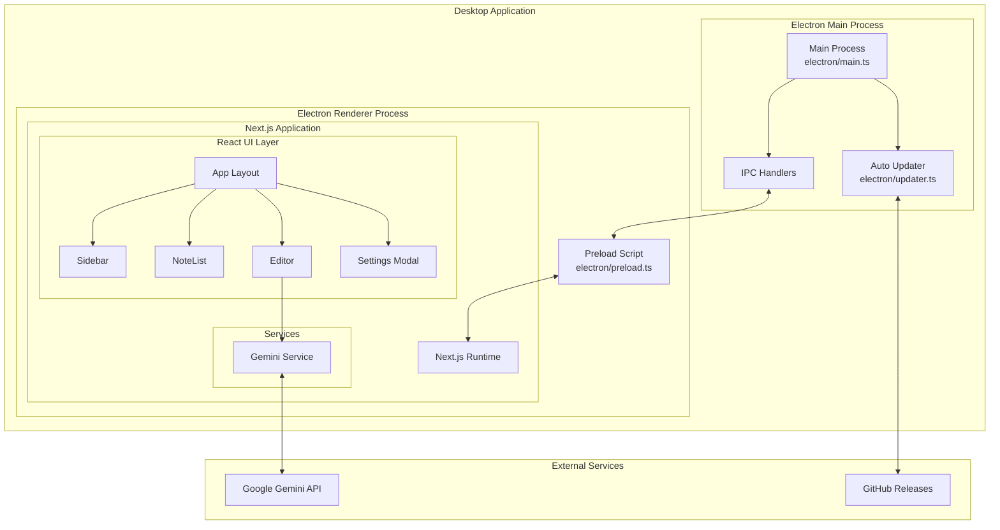
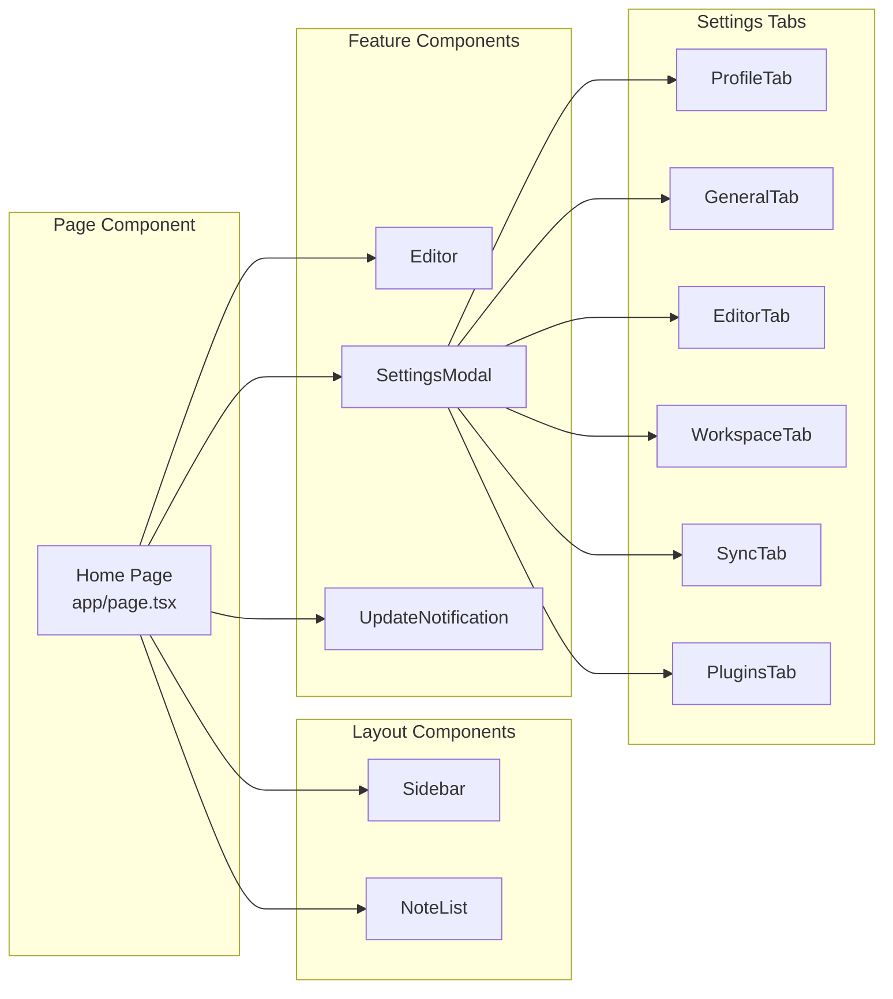
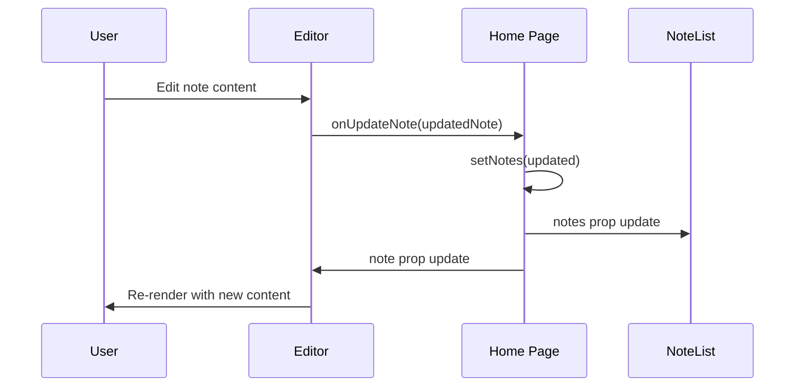
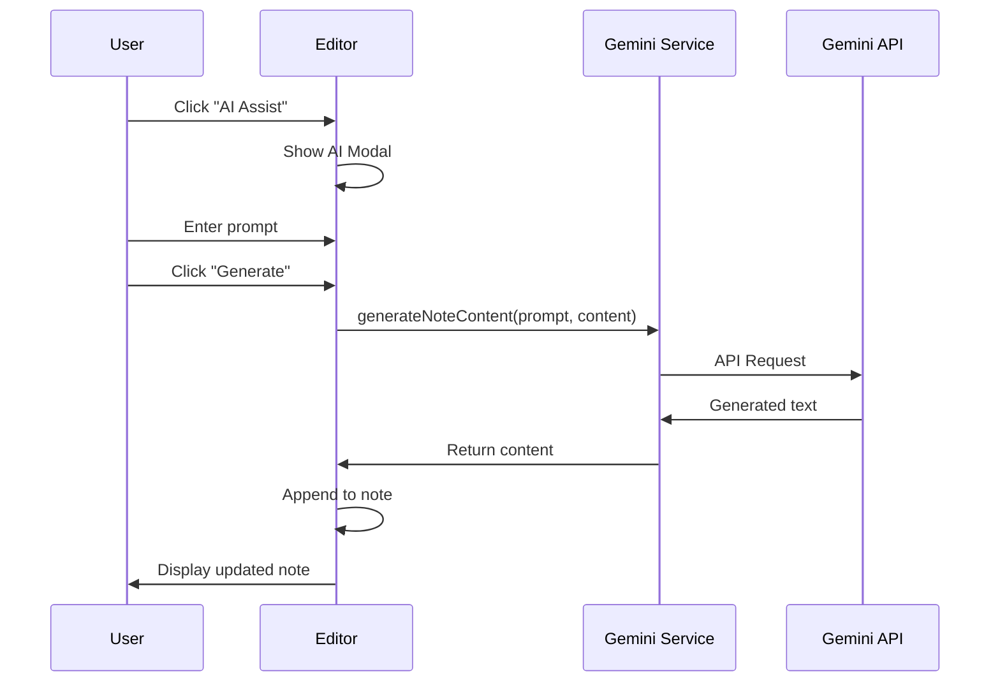
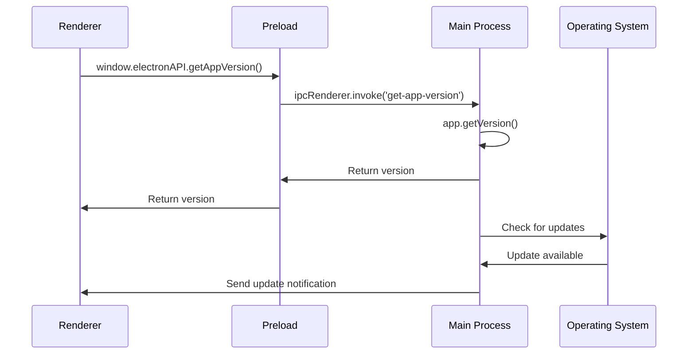
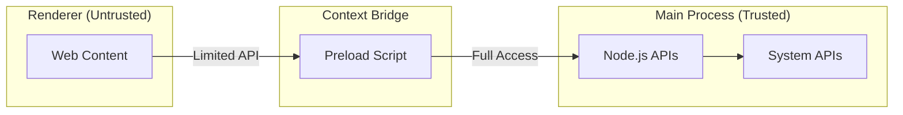
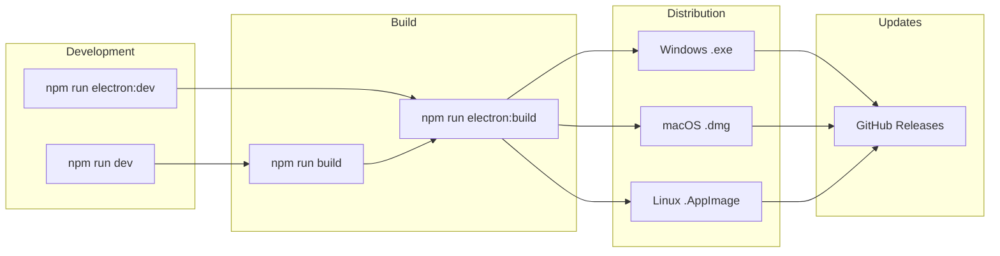

# System Architecture

## Overview

InkNote AI follows a hybrid desktop application architecture, combining a Next.js web application with Electron for native desktop capabilities.

## High-Level Architecture



## Component Architecture



## Data Flow

### Note Management Flow



### AI Generation Flow



### Electron IPC Flow



## Layer Architecture

### Presentation Layer

| Component | Responsibility |
|-----------|----------------|
| `app/page.tsx` | Main page, state management, layout |
| `Sidebar` | Notebook navigation, user profile |
| `NoteList` | Note listing and selection |
| `Editor` | Note editing, AI integration |
| `SettingsModal` | Application settings |

### Service Layer

| Service | Responsibility |
|---------|----------------|
| `gemini-service.ts` | AI content generation |
| `updater.ts` | Application updates |

### Data Layer

| Type | Current | Planned |
|------|---------|---------|
| Notes | In-memory state | SQLite database |
| Notebooks | Mock constants | SQLite database |
| Settings | Not persisted | Local storage / SQLite |

## Electron Architecture

### Process Model

```
┌─────────────────────────────────────────────────────┐
│                   Main Process                       │
│  ┌─────────────┐  ┌─────────────┐  ┌─────────────┐ │
│  │   main.ts   │  │  updater.ts │  │ IPC Handlers│ │
│  └─────────────┘  └─────────────┘  └─────────────┘ │
└─────────────────────────────────────────────────────┘
                         │
                    IPC Bridge
                         │
┌─────────────────────────────────────────────────────┐
│                 Renderer Process                     │
│  ┌─────────────┐  ┌──────────────────────────────┐ │
│  │ preload.ts  │──│     Next.js Application      │ │
│  └─────────────┘  └──────────────────────────────┘ │
└─────────────────────────────────────────────────────┘
```

### Security Model



**Security Features:**
- `contextIsolation: true` - Renderer can't access Node.js
- `nodeIntegration: false` - No direct Node access in renderer
- Preload script exposes only safe APIs via `contextBridge`

## State Management

### Current Approach

```typescript
// Component-level state in Home page
const [selectedNotebookId, setSelectedNotebookId] = useState<string | null>("ideas");
const [selectedNoteId, setSelectedNoteId] = useState<string | null>(MOCK_NOTES[0].id);
const [notes, setNotes] = useState<Note[]>(MOCK_NOTES);
const [sidebarOpen, setSidebarOpen] = useState(true);
const [noteListOpen, setNoteListOpen] = useState(true);
const [isMobile, setIsMobile] = useState(false);
const [settingsOpen, setSettingsOpen] = useState(false);
```

### State Flow

```
Home Page (State Owner)
    ├── Sidebar (receives: notebooks, selectedNotebookId)
    ├── NoteList (receives: notes, selectedNoteId)
    └── Editor (receives: note, onUpdateNote callback)
```

## File System Structure

```
Application Files
├── dist-electron/          # Compiled Electron code
│   └── electron/
│       ├── main.js
│       └── preload.js
├── out/                    # Next.js static export
│   ├── index.html
│   └── _next/
└── release/                # Built installers
    ├── win-unpacked/
    └── InkNote AI Setup.exe
```

## Technology Stack Diagram

```mermaid
graph TB
    subgraph "Frontend"
        REACT[React 19]
        NEXT[Next.js 16]
        TW[Tailwind CSS 4]
        TS[TypeScript 5]
    end

    subgraph "Desktop"
        ELECTRON[Electron 35]
        BUILDER[electron-builder]
        UPDATER[electron-updater]
    end

    subgraph "Editor"
        MDEDIT[@uiw/react-md-editor]
        MDPREV[@uiw/react-markdown-preview]
    end

    subgraph "AI"
        GENAI[@google/genai]
        GEMINI[Gemini 2.0 Flash]
    end

    subgraph "Database (Planned)"
        SQLITE[better-sqlite3]
    end

    NEXT --> REACT
    REACT --> TS
    NEXT --> TW
    ELECTRON --> NEXT
    MDEDIT --> REACT
    GENAI --> GEMINI
```

## Deployment Architecture



## Future Architecture Considerations

### Planned Improvements

1. **Database Layer**
   - SQLite for local persistence
   - Migrations system
   - Data sync abstraction

2. **State Management**
   - Consider Zustand or Jotai for complex state
   - React Query for async state

3. **Plugin System**
   - Plugin API definition
   - Sandboxed plugin execution
   - Plugin marketplace

4. **Cloud Sync**
   - Sync service abstraction
   - Conflict resolution strategy
   - Offline-first architecture

---

*Last Updated: 2026-02-02*
