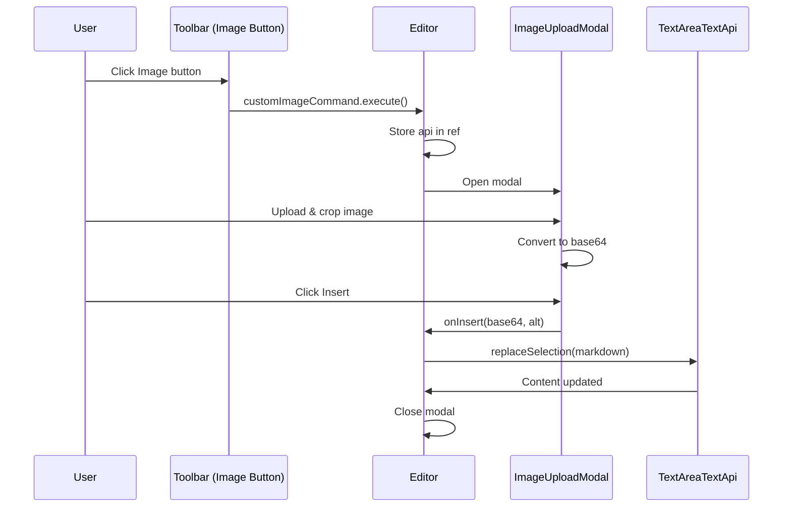

# Phase 3: MDEditor Integration

## Context

| Field | Value |
|-------|-------|
| **Parent Plan** | [plan.md](plan.md) |
| **Dependencies** | [Phase 1](phase-01-core-infrastructure.md), [Phase 2](phase-02-image-editor-ui.md) |
| **Docs** | [system-architecture](../../docs/system-architecture.md) |

## Overview

| Field | Value |
|-------|-------|
| **Date** | 2026-02-02 |
| **Description** | Override MDEditor image command and integrate modal |
| **Priority** | High |
| **Implementation Status** | Not Started |
| **Review Status** | Pending |

## Key Insights

1. MDEditor supports custom commands via `commands` prop
2. Can override built-in image command by name
3. Need to store TextAreaTextApi ref for async insertion
4. Should preserve other toolbar commands

## Requirements

- Override default image command in MDEditor
- Store editor API reference for async operations
- Insert markdown image syntax at cursor position
- Handle modal state in Editor component
- Preserve existing toolbar functionality

## Related Code Files

| File | Purpose | Action |
|------|---------|--------|
| `components/editor/Editor.tsx` | Main editor | Modify |
| `components/editor/ImageUploadModal.tsx` | Modal | Modify |

## Implementation Steps

### Step 3.1: Create Custom Image Command

```typescript
// In Editor.tsx
import { commands, ICommand, TextAreaTextApi } from '@uiw/react-md-editor';
import { useRef } from 'react';

const editorApiRef = useRef<TextAreaTextApi | null>(null);

const customImageCommand: ICommand = {
  ...commands.image,
  execute: (state, api) => {
    // Store API ref for later use
    editorApiRef.current = api;
    // Open modal instead of default behavior
    setShowImageModal(true);
  },
};
```

### Step 3.2: Build Custom Commands Array

```typescript
import { getCommands } from '@uiw/react-md-editor';

// Get default commands and replace image
const customCommands = useMemo(() => {
  return getCommands().map(cmd =>
    cmd.name === 'image' ? customImageCommand : cmd
  );
}, [customImageCommand]);
```

### Step 3.3: Pass Commands to MDEditor

```typescript
<MDEditor
  value={note.content}
  onChange={handleChange}
  commands={customCommands}
  // ... other props
/>
```

### Step 3.4: Handle Image Insert from Modal

```typescript
const handleImageInsert = useCallback((base64: string, altText: string) => {
  if (editorApiRef.current) {
    const markdown = ``;
    editorApiRef.current.replaceSelection(markdown);
  }
  setShowImageModal(false);
}, []);
```

### Step 3.5: Connect Modal to Editor

```typescript
{showImageModal && (
  <ImageUploadModal
    isOpen={showImageModal}
    onClose={() => setShowImageModal(false)}
    onInsert={handleImageInsert}
  />
)}
```

### Step 3.6: Update Editor State

After inserting image, trigger note update:

```typescript
const handleImageInsert = useCallback((base64: string, altText: string) => {
  if (editorApiRef.current) {
    const markdown = ``;
    editorApiRef.current.replaceSelection(markdown);

    // Get updated content and notify parent
    // Note: MDEditor onChange will handle this automatically
  }
  setShowImageModal(false);
}, []);
```

## Data Flow



## Todo List

- [ ] Create customImageCommand
- [ ] Build customCommands array
- [ ] Add editorApiRef
- [ ] Add showImageModal state
- [ ] Implement handleImageInsert
- [ ] Connect ImageUploadModal
- [ ] Test image insertion
- [ ] Test with different cursor positions
- [ ] Test undo/redo after insert

## Success Criteria

- [ ] Clicking image button opens custom modal
- [ ] Default image dialog does NOT appear
- [ ] Image markdown inserted at cursor position
- [ ] Other toolbar buttons still work
- [ ] Note content updates correctly
- [ ] Can undo image insertion

## Risk Assessment

| Risk | Impact | Mitigation |
|------|--------|------------|
| API ref becomes stale | Medium | Refresh ref on each command execute |
| Large base64 slows editor | Medium | Limit max image size |
| MDEditor version changes | Low | Pin version in package.json |

## Security Considerations

- Alt text should be escaped for markdown
- Base64 data should be validated

## Testing Checklist

- [ ] Insert at beginning of document
- [ ] Insert at end of document
- [ ] Insert with text selected (should replace)
- [ ] Insert in middle of line
- [ ] Large image (test performance)
- [ ] Multiple image inserts
- [ ] Undo/redo functionality

## Next Steps

After Phase 3:
→ Feature complete! Ready for testing and code review.

## Post-Implementation

- [ ] Update documentation
- [ ] Add to changelog
- [ ] Consider adding image gallery feature (future)
